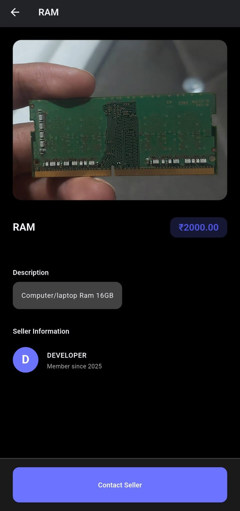

# Collex: A Cross-Platform Marketplace App

  

Excited to share a project I've been developing: **Collex**, a fully-featured, cross-platform marketplace application!

Built from the ground up with **Flutter** and **Dart**, Collex is designed to run smoothly on iOS, Android, and the Web from a single, unified codebase. The goal was to create a seamless and intuitive platform for communities to connect and trade.

## Download the App

You can download and test the Android APK directly from this repository:

[**Download Collex v1.0 APK**](./releases/collex-v1.0.apk)

## Key Features

🔹 **Secure & Flexible Authentication:** Users can sign up and log in securely using their email and password or through their Google account. The entire flow, from email verification to password resets, is handled to ensure a safe user environment.

🔹 **Dynamic & Interactive Marketplace:** The heart of the app is its marketplace. Users can effortlessly create listings for their items, complete with images and descriptions. The app provides a clean and engaging interface for browsing, searching, and discovering items from other users.

🔹 **Real-Time Chat for Instant Communication:** To make transactions smoother, I integrated a real-time chat feature using **Cloud Firestore**. This allows buyers and sellers to connect and communicate instantly without ever leaving the app.

🔹 **Personalized User Experience:** Features like a personal "Wishlist" allow users to save items they're interested in, creating a tailored shopping experience. Every user also has a profile to manage their listings and activity.

## Technical Stack

*   **Framework:** Flutter & Dart
*   **Backend:** Firebase (including Authentication, Cloud Firestore for the database, and Firebase Storage for image hosting)
*   **Architecture:** I focused on a clean, scalable architecture using the Provider model for state management, which keeps the code organized and easy to maintain.

## Screenshots

    &nbsp;&nbsp;
    &nbsp;&nbsp;
    &nbsp;&nbsp;
    
  

  

    &nbsp;&nbsp;
    &nbsp;&nbsp;
    
  

---
*This repository contains the public-facing showcase and release APK for the Collex application. The source code is private.*
